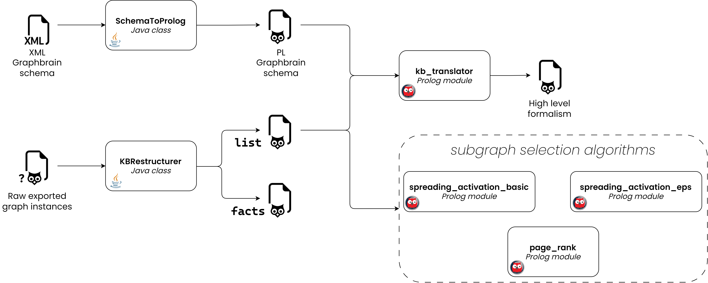

# Graph Brain: Ontology instances Restructurer and Graph ranker

This project contains code in both ***Java*** and ***Prolog*** to translate the instances of the Graph Brain ontologies in a more 
prolog friendly formalism as well as algorithms to rank the ontology graphs for selecting smaller portions of them.

The only input files needed by the project are:

* Raw graph instances file
* Original XML ontology schema file

They should be placed in the `inputs` directory located in the project root. 
All the outputs produced, will be saved in the `outputs` directory.

The whole pipeline can be visualized in the diagram below:

    

All source code is documented and follows well defined formalisms:
* [Javadoc](https://www.oracle.com/it/technical-resources/articles/java/javadoc-tool.html) for Java code;
* ["Coding Guidelines for Prolog" paper](https://arxiv.org/pdf/0911.2899.pdf) by *Michael A. Covington et Al.* for Prolog code

Check the ['How to use'](#how-to-use) section for more details on how to use this project!

## Requirements

**JAVA**: The *Java* code has been tested to work with ***JDK version 17***

**Prolog**: The *Prolog* code is intended to use with the *YAP* interpreter, but it can be easily run via *SWI Prolog* 
by following these simple steps:

1. Uncomment **line 19** of [page_rank.pl](src_prolog/page_rank.pl)
2. Uncomment **line 16** of [spreading_activation_basic.pl](src_prolog/spreading_activation_basic.pl)
3. Uncomment **line 17** of [spreading_activation_iter.pl](src_prolog/spreading_activation_iter.pl)

**IMPORTANT**: The *working directory* when running the project, both for *JAVA* and *Prolog* source code, must be the **root**
of the project!

## How to use

The general pipeline of the project can be visualized in the diagram in the [first section](#graph-brain-ontology-instances-restructurer-and-graph-ranker) of this `README.md`.

All *Java* modules must be executed before using the *Prolog* modules and before carrying out any operation,
the input files should be added to the `inputs` directory.
* Both the raw graph prolog exported instances file and the XML schema from Graph Brain should be provided.

### Java

1. First, the `main` of [KBRestructurer.java](src_java/KBRestructurer.java) should be run. The process will interact with the user for the following reasons:
    * To choose which KB file to use, if there are multiple `.pl` files in the `inputs` directory;
    * To choose the conversion mode between `list` and `facts`;
    
        e.g. ***List conversion mode:*** `node_properties(0, '{name=Jack}'}).` ---> `node_properties(0, ['name'-'Jack']).`

        e.g. ***Facts conversion mode:*** `node_properties(0, '{name=Jack}'}).` ---> `name(0, 'Jack').`
        
    * To choose if `arc` predicates should be split into `arc` and `arc_properties` predicates before starting the restructuring process. This is an intermediate step that **MUST** be performed because of how raw instances are exported, but can be skipped
    if the exporting process for arcs will be made homogenous to the one for entities  
    
        
        e.g. `arc(0, 'isA', 5, 6).` -> `arc(0, 5, 6).` and `arc_properties(0, '{subClass=isA}')`
    
    * After completing this step, the restructured KB in *Prolog* format will be saved in the `outputs` directory. The filename format
    will be `{mode}_{rawInstancesFilename}.pl`
        - e.g. `exportedGraph.pl` with selected conversion mode `list`  ---> `list_exportedGraph.pl`

2. After that, the `main` of [schemaToProlog.java](src_java/SchemaToProlog.java) should be run. The process only interacts with the user
in case there are multiple `.xml` files in the `inputs` directory, asking to select which one to use.
    * After completing this step, the converted schema in *Prolog* format will be saved in the `outputs` directory. The filename format
    will be `schema_{schemaFilename}.pl`
        
        e.g. `retrocomputing.xml` ---> `schema_retrocomputing.pl`

### Prolog

Now that all the inputs have been processed, the *Prolog* modules can be used.

* To convert the KB to the higher level formalism, `consult` the [kb_translator.pl](src_prolog/kb_translator.pl) module and
use the `translate/0` procedure. Node that, this step will only work for a KB file in `list` format, check [point 2](#Java) of the *Java* instructions.
    * The process only interacts with the user in case there are multiple *list based formalism* restructured KB files or if 
    there are multiple converted *Prolog* schema files in the `outputs` directory, asking to select which one to use. 

* To rank instances of the graph, multiple algorithms are available:
    * All of these processes only interact with the user in case there are multiple *list based formalism* restructured KB files in the 
    `outputs` directory, asking to select which one to use. 

    #### Page Rank

    To use the page rank algorithm, `consult` the [page_rank](src_prolog/page_rank.pl) module and use one of the following predicates: `page_rank/0`, `page_rank/3` or `page_rank/5`.

    All the parameters that can be specified for `page_rank/5` are the following:
    - **DampingFactor**: Damping parameter of Page Rank used to decide probability of jumping to random node or to follow outgoing links from a node;
    - **Epsilon**: Tolerance to check if convergence has been reached in *L1 norm*;
    - **MaxIter**: Number of maximum iterations of the PageRank algorithm, after which the algorithm will stop regardless of having reached convergence or not;
    - **RankStartVector**: List of `NodeID-Value` pairs defining the values which will be used to initialize the rank vector;
    - **PersonalizationVector**: List of `NodeID-Value` pairs defining the personalization values of selected nodes.

    If the `page_rank/3` procedure is used, `RankStartVector` and `PersonalizationVector` will be initialized empty (which means that uniform distribution will be used to initialize both of them).

    If the `page_rank/0` procedure is used, the other parameters are also initialized as follows: `DampingFactor=0.85`, `Epsilon=1e-6` and `MaxIter=100`.

    Once the algorithm has completed, results can be checked by using the `rank/2` predicate of the module. The predicates associates each NodeID to the associated page rank value.

    e.g. `rank(0, X).` ---> `X = 0.00023.`

    #### Spreading Activation (Basic)

    To use the spreading activation (basic) algorithm, `consult` the [spreading_activation_basic.pl](src_prolog/spreading_activation_basic.pl) module and use the following predicate: `spreading_activation/3`.

    All the parameters that can be specified for `spreading_activation/3` are the following:
    - **StartNodes**: List of node identifiers to use as 'start nodes' (their activation value will be set to 1);
    - **FiringThreshold**: The minimum activation value necessary for a node to keep spreading over to its neighbors;
    - **DecayRate**: The activation value decay when it is spread to neighboring nodes (ex. with decay rate 0.9 and activation value for current node 0.7, the final value will be 0.9 * 0.7).

    Once the algorithm has completed, results can be checked by using the `activation/2` predicate of the module. The predicates associates each NodeID to the associated activation value.

    e.g. `activation(0, X).` ---> `X = 0.00023.`

    #### Spreading Activation (Iterative)

    While in the **Basic** formulation fired nodes are never considered again to spread their activation value in the successive iterations, the **Alternative** formulation considers all nodes (already fired or unfired) as long as their activation value exceeds the threshold. The algorithms stops when either convergence or maximum number of iterations has been reached.

    To use the spreading activation (iterative) algorithm, `consult` the [spreading_activation_iter.pl](src_prolog/spreading_activation_iter.pl) module and use one of the following predicate: `spreading_activation/3` or `spreading_activation/6`.

    All the parameters that can be specified for `spreading_activation/6` are the following:
    - **StartNodes**: List of node identifiers to use as 'start nodes' (their activation value will be set to 1);
    - **FiringThreshold**: The minimum activation value necessary for a node to keep spreading over to its neighbors;
    - **DecayRate**: The activation value decay when it is spread to neighboring nodes (ex. with decay rate 0.9 and activation value for current node 0.7, the final value will be 0.9 * 0.7);
    - **GeometricDecayFactor**: Factor by which the DecayRate will be reduced at the end of the iteration;
    - **Epsilon**: Threshold value, the algorithm will stop once the L1 norm of the activation values is lower than this value;
    - **NMaxIter**: Maximum number of iterations after which the algorithm will stop regardless of convergence.

    If the `spreading_activation/3` procedure is used, the following parameters are initialized: `GeometricDecayFactor=0.8`, `Epsilon=1e-5` and `MaxIter=100`.

    Once the algorithm has completed, results can be checked by using the `activation/2` predicate of the module. The predicates associates each NodeID to the associated activation value.

    e.g. `activation(0, X).` ---> `X = 0.00023.`

Project Organization
------------
    ├── 📁 imgs                       <- Directory which contains images for the reports and README.md
    │
    ├── 📁 inputs                     <- Directory where to put input data to process (exported graph and schema)
    │
    ├── 📁 outputs                    <- Directory which will contain all outputs of the modules
    │
    ├── 📁 src_java                   <- Java source code of the project
    │   ├── 📁 xmlschemaelement           <- Java package containing classes to fully process GraphBrain XML schema
    │   │   ├── 🍵 Entity.java
    │   │   ├── 🍵 Relationship.java
    │   │   ├── 🍵 XMLSchemaElement.java
    │   │   └── 🍵 XMLSchemaScanner.java
    │   │
    │   ├── 🍵 KBRestructurer.java
    │   └── 🍵 SchemaToProlog.java
    │
    ├── 📁 src_prolog                 <- Prolog source code of the project
    │   ├── 🦉 kb_high_level_translator.pl
    │   ├── 🦉 page_rank.pl
    │   ├── 🦉 spreading_activation_basic.pl
    │   ├── 🦉 spreading_activation_eps.pl
    │   └── 🦉 utils.pl
    │
    ├── 📄 LICENSE                    <- MIT License
    ├── 🐍 page_rank_comparison.ipynb <- IPython notebook for checking the correctness of the Prolog PR implementation 
    └── 📄 README.md                  <- The top-level README for using this project
